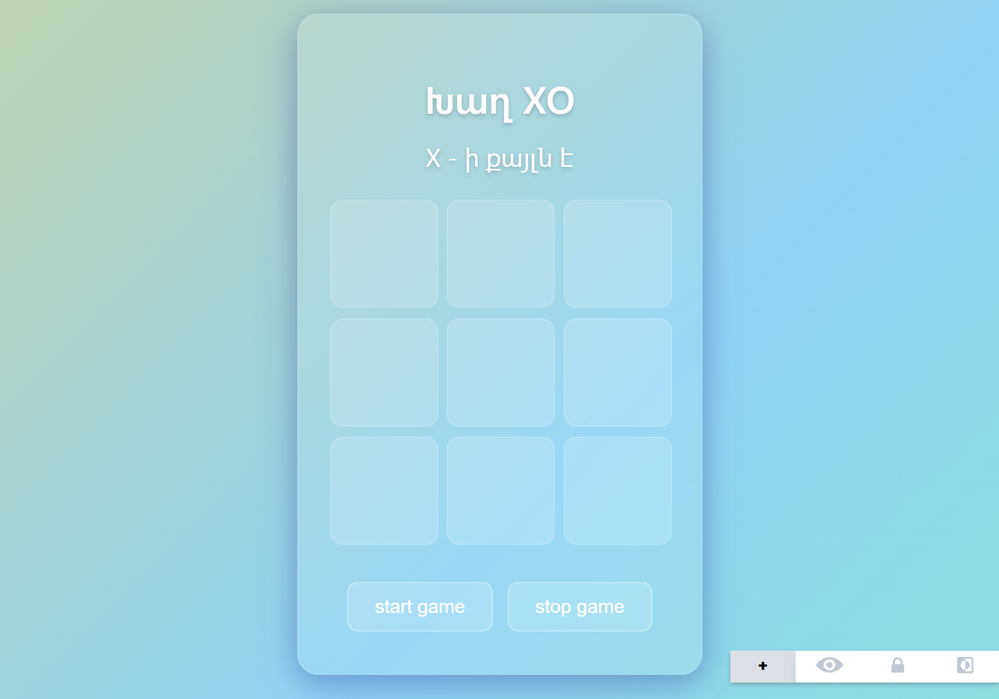

XO Game (Tic-Tac-Toe with AI)

XO Game is a classic Tic-Tac-Toe web application built with HTML, CSS, and JavaScript.
It offers two game modes — Player vs Player and Player vs AI — making it both fun and challenging.

Features

🎮 Two Game Modes

🧍‍♂️ Player vs Player — two human players take turns on the same device.

🤖 Player vs AI — challenge a computer opponent with smart move logic.

🏆 Win detection and draw recognition

🔄 Option to restart the game anytime

📱 Responsive design that works on both desktop and mobile devices

✨ Smooth animations and simple, intuitive UI

Installation

Clone the repository and open the main file locally:

git clone https://github.com/Amailya/x--o-play
cd xo-game
open index.html

For Windows users:

start index.html

Usage

Once the game opens in your browser:

Choose a mode — Player vs Player or Player vs AI.

The first player (X) starts the game.

Click on an empty square to make a move.

The game will automatically detect when someone wins or if it’s a draw.

Click Restart to play again.

Example Gameplay Previews
📸 

Technologies Used

HTML5 — for the game structure and UI

CSS3 — for layout, animations, and responsive design

JavaScript (ES6) — for game logic, AI moves, and interactivity

Code Example
// Simple AI move logic example
function aiMove() {
  const emptyCells = cells.filter(cell => !cell.textContent);
  const randomCell = emptyCells[Math.floor(Math.random() * emptyCells.length)];
  if (randomCell) {
    randomCell.textContent = 'O';
    checkWinner();
  }
}

Future Improvements

🧠 Smarter AI using the Minimax algorithm

🎨 Add sound effects and score tracking

🔥 Online multiplayer support

Contributing

Contributions are always welcome!
If you’d like to improve the AI logic, UI design, or add new features, please open an issue first to discuss your ideas.

Please make sure to test all new features thoroughly before submitting pull requests.